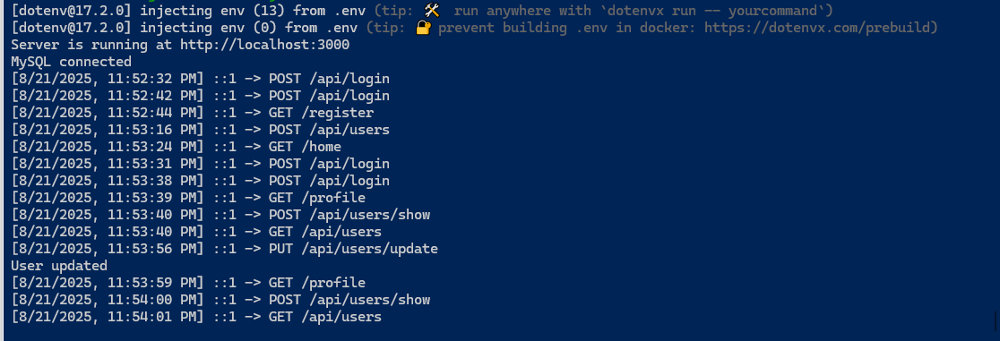
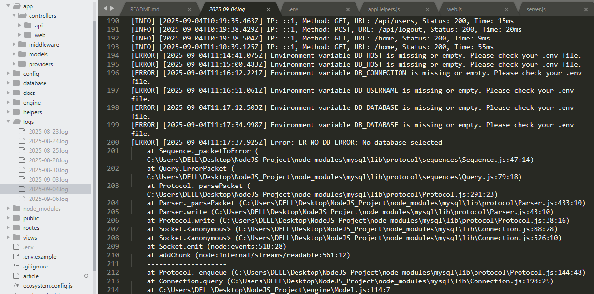

## MVC APP `Node.js` (No Express)
A lightweight **Node.js** project that follows the **MVC (Model-View-Controller)** architecture, built from scratch, without using any framework like `Express`. This project is ideal for learning the core backend architecture, routing mechanisms and `MySQL` integration in raw Node.js.

## Introduction
This project brings a **Laravel-like workflow** to **Raw Node.js**: a clean `MVC` structure, a custom router, middleware pipeline, a Route Service Provider, Form validation, a simple view template engine and a model layer powered by MySQL.

## Key Features
- **Custom Routing System**
- **MVC Folder Structure**
- **Middleware Support**
- **Route Service Provider Support(Handles `web` and `api` routes with `/api` prefix)**
- **Global Rate Limiter Support (limits requests per IP with customizable limits and time windows)**
- **Route Logger Middleware (`Date Time`, `Logs IP`, `Method` and `Path` of each request in terminal)**
- **Session Management (in-memory sessions for persisting user data like `CSRF` token.)**
- **`CSRF` Protection (middleware that secures `POST`, `PUT`, `DELETE` requests using a session-based `CSRF` token with global helper method `getCsrfToken(req, res)`)**
- **`XSS` Protection (middleware that sanitizes request `body`, `query` and `params` to remove harmful `HTML/JS` tags)**
- **`CORS` Support (middleware for handling `Cross-Origin Resource Sharing` with customizable `origins`, `methods` and `headers`)**
- **Security Headers (middleware that sets HTTP headers to protect against `XSS`, `Clickjacking`, `MIME sniffing` and insecure connections, e.g., `X-Content-Type-Options`, `X-Frame-Options`, `X-XSS-Protection`, `Strict-Transport-Security`, `Content-Security-Policy`)**
- **Namespace Support (`module-alias`) - Define custom aliases like `@app`, `@config`, `@engine` for cleaner import paths instead of long `../../../` requires.**
- **Mail Service (Environment-based: `Mailtrap` for development)**
- **MySQL Integration (using `mysql` driver)**
- **Built-in password hashing (`crypto`)**
- **Custom View Engine (`View.js`)**
- **Bootstrap Frontend (inside `/public`)**
- **File Upload Support via `formidable`**
- **Form Input Fields Validation (`Server-side` validation with customizable `rules` and `messages`)**
- **Environment Configuration Support** (`.env`)
- **Request Body Parsing**

  &emsp;• `application/json`  
  &emsp;• `x-www-form-urlencoded`  
  &emsp;• `multipart/form-data` (via `formidable`) 

## Security Features
- **XSS Protection:** Sanitizes user input & encodes output to prevent `Cross-Site Scripting` attacks.
- **SQL Injection Safe Queries:** Uses prepared statements or query builders to prevent `SQL Injection`.
- **CSRF Protection:** Blocks unauthorized form submissions using `CSRF` tokens(Only `web` routes).
- **CORS:** Allows requests only from specified origins to prevent `cross-origin` misuse (Only `api` routes).
- **Rate Limiter:** Limits requests per `IP` or user to protect against `brute-force` or `DDoS` attacks.
- **Route Logger:** Logs each request (`IP`, `method`, `path` and `time`) for monitoring and auditing.
<!-- - **Security Headers:** Sets HTTP headers to protect against `XSS`, `Clickjacking`, `MIME sniffing` and insecure connections. Key headers include `X-Content-Type-Options`, `X-Frame-Options`, `X-XSS-Protection`, `Strict-Transport-Security`, and `Content-Security-Policy`. -->

## Sample Features
 - User Registration & Login
 - Form Validation with error handling
 - Display Error Messages
 - Edit & Delete records
 - Secure User Logout  
 - Mail Service  
 - RESTful API routes under `/api`

## Folder Structure
<pre lang="bash">
project/
├── app/
│ ├── controllers/
│ │ ├── web/
│ │ └── api/
│ ├── middleware/
│ └── models/
│ └── providers/
|	├── RouteServiceProvider.js
├── config/
│ ├── cors.js
│ ├── db.js
│ ├── env.js
│ └── mail.js
├── database/
│ ├── migrations/
│ └── index.js
├── helpers/
│ ├── appHelpers.js
│ ├── response.js
│ └── utilities.js
├── public/
│ ├── bootstrap/
│ ├── css/
│ ├── js/
│ ├── images/
│ └── fonts/
├── routes/
│ ├── web.js
│ └── api.js
├── engine/
│ ├── middleware (Runtime Middleware)
| |	├── RateLimiter.js
│ | ├── RouteLogger.js
│ | ├── XssProtection.js
│ | ├── RequestLogger.js
│ | ├── CsrfMiddleware.js
│ | ├── CorsMiddleware.js
│ | └── SecurityHeadersMiddleware.js
│ ├── security
│ | ├── Csrf.js
│ | ├── Logger.js
│ | ├── Session.js
│ | └── Sanitizer.js
│ ├── services
│ | ├── MailService.js	
│ ├── Route.js
│ ├── Model.js
│ ├── View.js
│ ├── Middleware.js
│ ├── Validation.js
│ ├── ApiRoute.js
│ ├── webRoute.js
│ └── StaticFileHandler.js
├── views/
│ ├── layouts/
│ └── pages
├── .env
├── ecosystem.config.js(PM2)
├── package.json
├── server.js
└── README.md</pre>

## Application Lifecycle
1. **server.js** boots the HTTP server and loads the router.
2. **RouteServiceProvider** merges `web` and `api` routes and applies global middleware.
3. **engine/Route.js** resolves the incoming request and dispatches to the controller action.
4. Controller calls **Model**/**View**/**helpers** as needed and returns a response.

## Requirements
- Node.js 22
- MySQL 5.7/8+
- npm 10

## Getting Started
<pre lang="bash">
git clone git@github.com:alamincse/mvc-app-nodejs.git
cd crud-app-mvc-nodejs
</pre>

#### Rename the `.env.example` file to `.env`

## Install Dependencies
<pre lang="bash">
npm install
</pre>

## Required Packages Install
<pre lang="bash">
npm install mysql
npm install dotenv
npm install sanitize-html
npm install formidable (Support `multipart/form-data` or `form-data` in postman)
npm install nodemon --save-dev
npm install pm2 --save-dev
npm install module-alias --save
npm install nodemailer</pre>

## Start the server
```bash
1. npm run dev 			# Development Mode (Auto Restart on file changes)
2. npm start 			# or Normal Mode
3. node server 			# or Directly with `Node.js`
4. nodemon server 		# or Directly with `nodemon` (Auto Restart on file changes)

# Run via PM2
npm run pm2:start       # Development
npm run pm2:prod        # or Production
npm run pm2:staging     # or Staging

npm run pm2:stop        # Stop all PM2 processes
npm run pm2:restart     # Restart all PM2 processes
npm run pm2:delete      # Delete all PM2 processes
npm run pm2:logs  		# PM2 View logs
```

## Run Database Migration
A simple migration runner lives under `database/`. Add migration files under `database/migrations` and register them in `database/index.js`. Run the following command to create tables: Make sure `.env` is properly configured with your `MySQL` credentials.

```bash
nodemon database

# or:
node database
```

## Routing
#### Define your application routes within the `routes/web.js` or `routes/api.js`, depending on whether the route is intended for `web` or `API` usage.
#### `routes/web.js`
```js
const Route = require('@engine/WebRoute');
const UserController = require('@app/controllers/web/UserController');

Route.get('/users', UserController.index);
Route.post('/users', UserController.store);

module.exports = Route;
```

#### `routes/api.js`
```js
const Route = require('@engine/ApiRoute');

const UserController = require('@app/controllers/api/UserController');
const AuthController = require('@app/controllers/api/AuthController');

Route.post('/users', UserController.store);
Route.post('/login', AuthController.create);

module.exports = Route;
```

### API Prefix
All routes from `routes/api.js` are automatically prefixed with `/api` via the **RouteServiceProvider**.

### Global Rate Limiting
`IP-based rate limiting` to prevent abuse and ensure fair usage. By default, a basic throttling rule (e.g. `60 requests per minute`) is applied globally through the `RouteServiceProvider`

```js
configureRateLimiting() {
    // Allow max 60 requests per 1 minute per IP
    const limit = 60;
    const time = 60 * 1000; // 1 minute

    const globalRateLimiter = new RateLimiter(limit, time);

    return globalRateLimiter?.handle;
}
```
- ***Limit:*** Maximum number of requests allowed within the time window.
- ***Scope:*** Applied globally to all routes unless overridden.
- ***Behavior:*** Exceeding the limit returns a `429 Too Many Requests` response.

## Route Service Provider
A central place to register routes and apply global middleware like the **RouteLogger**, **XssProtection**, **CsrfMiddleware**, **CorsMiddleware** and **RateLimiter**.

### Route Logger
Logs every request with `timestamp`, `IP`, `method` and `path`


### CSRF Middleware Protection
#### Overview
`CSRF` (Cross-Site Request Forgery) middleware provides protection for state-changing HTTP requests (`POST`, `PUT`, `DELETE`) by verifying a `CSRF` token in the request.

This middleware is only applied to `web` routes, while `API` routes are excluded.

- A global helper method `getCsrfToken(req, res)` is available.
- It automatically generates (if not already created) and retrieves the `CSRF` token stored in the session.
- You can use this token inside your `controllers` or pass it to `views` for secure form submissions.
- On form submission, the `CSRF` Middleware checks the submitted token against the session token.
- If the token is invalid or missing, the request is rejected with `403 Forbidden`.


#### 1. Protecting State-Changing Requests
`CSRF` middleware automatically checks requests with methods:
- `POST`
- `PUT`
- `DELETE`

It looks for the token in:
- `req.body.csrfToken`
- `req.query.csrfToken`
- `req.headers['x-csrf-token']`

#### 2. Response When Token is Invalid
If a `CSRF` token is missing or invalid:
```bash
HTTP/1.1 403 Forbidden
{
    "error": "Invalid CSRF token"
}
```

#### 3. Example Usage in Controller:
```js
const token = getCsrfToken(req, res);
```

```js
class HomeController {
	async index(req, res) {
		try {
  			const token = getCsrfToken(req, res);

			const html = await view('home', {
				csrfToken: token, // pass csrf token to `home` view
			});

			res.writeHead(200, { 'Content-Type': 'text/html' });
			res.end(html);
		} catch (err) {
			res.writeHead(500, { 'Content-Type': 'text/plain' });
			res.end(err.message);
		}
	}

	async login(req, res) {
		try {
			// your code here...

			return response.json(res, {
				success: true,
				message: 'Success',
				data: 'data',
			});
		} catch (err) {
			console.log(err);

			return response.error(res, 'Failed');
		}
	}
}
```

#### 4. Example Usage in View:
	<form method="POST" action="/">
		<input type="hidden" id="csrfToken" name="csrfToken" value="{{ csrfToken }}">
		<button type="submit">Submit</button>
	</form>

#### 5. Example API Call
```js
let res = await axios.post('/login', {
			email: email,
			password: password,
			csrfToken: csrfToken,
		});
```


## Middleware
Middleware are simple functions with signature `(req, res, next)`. They handle cross-cutting concerns like `authentication`, `logging` or `validation`.
```js
const Route = require('@engine/WebRoute');
const AuthMiddleware = require('@app/middleware/AuthMiddleware');
const UserController = require('@app/controllers/web/UserController');

// add middleware(`AuthMiddleware`)
Route.post('/users', UserController.store, [AuthMiddleware]); 

module.exports = Route;
```


## Controller Example
Controllers live under `app/controllers/{web|api}`.
#### `app/controllers/api/UserController.js`
```js
const response = require('@helpers/response');
const User = require('@app/models/User');

class UserController {
  async index(req, res) {
	try {
	  const result = await User.all();

	  return response.json(res, {
		success: true,
		message: 'Success',
		data: result,
	  });
	} catch (err) {
	    console.log(err);

	    return response.error(res, 'Failed');
	 } 
  }
}

module.exports = new UserController();
```


## Model Example
Models extend the base `engine/Model.js` class and define **table** and **fillable fields**.
#### `app/models/User.js`
```js
const Model = require('@engine/Model');

class User extends Model {
  constructor() {
	super('users', [
	  'name',
	  'email',
	  'password',
	]);
  }
}

module.exports = new User();
```
- `users` → Name of the database table
- `['name', 'email', 'password']` → Array of fields that are allowed for mass assignment(Fillable fields)


## View Engine
The `View.js` engine renders HTML files with `{{ title }}` and `{{ content }}` placeholders, like a mini `Blade` or `EJS` system.
<!-- views/layouts/main.html -->
	<html>
		<head>
	  		<title>{{ title }}</title>
  		</head>
	  	<body>
    		{{ content }}
	  	</body>
	</html>

## Environment Configuration
<pre lang="js">
DB_CONNECTION=mysql
DB_HOST=localhost
DB_USERNAME=root
DB_PASSWORD=secret
DB_DATABASE=mvc_node_app
DB_PORT=3306

SECRET_KEY=

APP_STAGING_ENV_PORT=3000
APP_STAGING_ENV_NAME=staging

APP_DEVELOPMENT_ENV_PORT=4000
APP_DEVELOPMENT_ENV_NAME=development

APP_PRODUCTION_ENV_PORT=5000
APP_PRODUCTION_ENV_NAME=production

APP_BACKLOG=511

MAIL_DRIVER=smtp
MAIL_HOST=sandbox.smtp.mailtrap.io
MAIL_PORT=2525	
MAIL_SECURE=false
MAIL_USER=username
MAIL_PASS=secret
MAIL_TIMEOUT=1000

MAIL_FROM_ADDRESS=noreply@example.com
MAIL_FROM_NAME="MVC APP"

MAIL_QUEUE=
MAIL_QUEUE_DRIVER=</pre>

## SECRET_KEY Configuration
The application requires a `SECRET_KEY` to ensure security for encryption, sessions and other security-related features. If `SECRET_KEY` is missing in the `.env` file, the application will throw an error.

#### How to Set `SECRET_KEY`
- Open your `.env` file (create one if it doesn't exist).
- Locate the `SECRET_KEY` variable (already present in `.env.example`).
- Replace its value with a secure random string (minimum `40` or `64` characters).

#### Example
```js
SECRET_KEY=1a2b3c4d5e6f7g8h9i0jklmnopqrstuvwxyzABCDEFGHIJKL1234560
```

## XSS Protection Middleware
This app includes a custom **XSS Protection Middleware** built on top of [`sanitize-html`](https://www.npmjs.com/package/sanitize-html).  
It automatically sanitizes **request body**, **query params**, and **route params** to prevent malicious `HTML/JS` injection (`XSS` attacks).

#### Why this matters?
- Prevents Cross-Site Scripting (`XSS`) attacks
- Cleans up all user supplied input
- Keeps the app secure by default

#### Input
```json
{
  "name": "<script>alert('Hacked!')</script>",
  "about": "Hello World"
}
```

#### Output
```json
{
  "sanitized": {
    "name": "",
    "about": "Hello World"
  }
}
```


## CORS (Cross-Origin Resource Sharing)
`CORS` stands for `Cross-Origin Resource Sharing`. It’s a security feature implemented by browsers that blocks requests from different `origins` (`domains`, `ports` or `protocols`) unless the server explicitly allows them.

#### Example:
Frontend: `http://localhost:3000`

Backend API: `http://localhost:8000`

By default, the browser will block the request unless `CORS` is enabled on the backend.

#### Why Do We Need CORS?
- To allow communication between frontend and backend hosted on different origins.
- To prevent unauthorized access to server resources.
- To control which domains can interact with your server.

#### How CORS Works
1. Simple Request (`GET/POST` without custom headers)
	- Browser directly sends the request.
	- Server must include `Access-Control-Allow-Origin`.

2. Preflight Request (`POST/PUT/DELETE` with custom headers)
	- Browser first sends an `OPTIONS` request (Preflight).
	- Server responds with allowed methods & headers.
	- If allowed, browser sends the actual request.

<!-- #### Security Headers
Security Headers are HTTP response headers that instruct the browser to enforce specific security policies. They primarily protect a web application from attacks such as `XSS` (Cross-Site Scripting), `Clickjacking`, `MIME sniffing`, `referrer leakage`, `enforces HTTPS` and other insecure connection vulnerabilities.

- Key headers:
  - `X-Content-Type-Options: nosniff`
  - `X-Frame-Options: SAMEORIGIN`
  - `X-XSS-Protection: 1; mode=block`
  - `Strict-Transport-Security: max-age=31536000; includeSubDomains`
  - `Referrer-Policy: no-referrer-when-downgrade`
  - `Content-Security-Policy: default-src 'self'` -->

## Request Logger (File Logging)
The `RequestLogger` middleware records every incoming HTTP request and can also be extended to log errors into `daily` log files inside a `logs/` folder.

#### Each log entry contains:
- `Date Time` of the request
- Client `IP` Address
- HTTP Method (`GET`, `POST`, `PUT` & `DELETE` etc.)
- Request Path

#### Benefits
- Automatic daily log files (`YYYY-MM-DD.log`)
- Centralized `logs/` folder for easy access
- Works in both `development` & `production`
- Extendable to log `info`, `warnings`, `errors` or `custom events`


## Mail Service
A simple extensible mail service for MVC Node.js applications. Supports environment-based configuration (e.g., `Mailtrap` for development) via `config/mail`

#### Features
- SMTP driver using `nodemailer`
- Configurable `from` address and name
- Supports both `text` and `html` emails
- Reusable service with `async/await` support
- Environment-based driver switching (e.g. `dev`, `prod`)

#### Environment Variables (`.env`)
<pre lang="js">
# Mail driver
MAIL_DRIVER=smtp
MAIL_HOST=sandbox.smtp.mailtrap.io
MAIL_PORT=2525	
MAIL_SECURE=false
MAIL_USER=username
MAIL_PASS=secret
MAIL_TIMEOUT=1000

# Default sender info
MAIL_FROM_ADDRESS=noreply@example.com
MAIL_FROM_NAME="MVC APP"
</pre>

**Note:** In `production`, replace Mailtrap credentials with `Mailgun` (or any other `SMTP`) credentials.

#### Usage Example (Controller):
```js
const MailService = require('@engine/services/MailService');

// Send a welcome email to a newly registered user!
(async () => {
    try {
        await MailService.sendMail({
            to: 'user@example.com',
            subject: 'Welcome to MVC APP',
            text: 'Hello! Thank you for registering.',
            html: '<b>Hello User,</b> Thank you for your registration!'
        });
        console.log('Mail sent successfully!');
    } catch (err) {
        console.error('Mail sending failed:', err);
    }
})();
```

## Namespace (Module Alias)
This project uses `module-alias` to simplify import paths with custom `namespaces`. Instead of writing long relative paths like `../../../app/controllers/api/UserController`, you can use short aliases such as `@app/controllers/api/UserController`

### Setup
Add aliases in `package.json`
```js
{
	"_moduleAliases": {
    	"@app": "app",
    	"@config": "config",
		"@database": "database",
		"@helpers": "helpers",
		"@public": "public",
		"@routes": "routes",
		"@engine": "engine",
  	}
}
```

### Example uses
```js
const UserController = require('@app/controllers/api/UserController');
const User = require('@app/models/user');
```

## Logger 
A lightweight Node.js logging utility for writing logs to console and daily log files.  
Supports **INFO**, **WARN** and **ERROR** levels.  

### Features
- Automatically creates a `logs/` directory if it doesn’t exist.
- Creates a new log file per day (`YYYY-MM-DD.log`).
- Handles global errors:
  - `uncaughtException`
  - `unhandledRejection`
- Writes logs to both the console and file.


### Available helper methods
```js
// Log info
Log.info('Server started on port 3000');

// Log warning
Log.warn('Memory usage is high');

// Log error
Log.error('Database connection failed');
```

### Output
Inside the `logs` folder, you will find log files organized `date-wise`.



## Global Helper Methods
Globally accessible helper methods for this application. These are attached to the `global` object to avoid repeated imports across files.

### Available Helpers
#### 1. `view(template, data = {})`: Render a view template with data.
```js
const html = view("home", { title: "Welcome" });
```
**Parameters:**
- `template (string)` — View template name.
- `data (object, optional)` — Data to pass to the view.
**Returns:** string (rendered HTML)

#### 2. `dd(data, exit = false)`: Debug helper - prints data and optionally stops execution.
```js
dd(user); // Just print
dd(request, true); // Print and stop execution
```
**Parameters:**
- `data (any)` — Data to print.
- `exit (boolean, default: false)` — If true, execution stops.


#### 3. `getCsrfToken(req, res)`: Get or generate a **CSRF** token for a request.
```js
const token = getCsrfToken(req, res);
```
**Parameters:**
- `req (object)` — Incoming request.
- `res (object)` — Response object.

**Returns:** `string|null`

#### 4. `hash(str)`: Hash a string using `HMAC-SHA256`.
```js
const hashed = hash("password");;
```
**Parameters:**
- `str (string)` — String to hash.

**Returns:** `string` (hashed hex) or `false` on error

#### 5. `hash(str)`: Hash a string using `HMAC-SHA256`.
```js
const hashed = hash("password");
```
**Parameters:**
- `str (string)` — String to hash.

**Returns:** `string` (hashed hex) or `false` on error


#### 6. `parseCookies(cookieHeader = "")`: Parse a raw cookie header into an object.
```js
const cookies = parseCookies("user=alamin; session=xyz123");
```
**Parameters:**
- `cookieHeader` (string) — Raw cookie header.

**Returns:** `object` (key-value map of cookies)


#### 7. `getBearerToken(headers)`: Extract Bearer token from headers.
```js
const token = getBearerToken(req.headers);
```
**Parameters:**
- `headers` (object) — HTTP headers

**Returns:** `string|null`


#### 8. `createRandomString(strLength = 40)`: Create a random alphanumeric string.
```js
const token = createRandomString(30);
```
**Parameters:**
- `strLength` (number, `default: 40`)

**Returns:** `string`


#### 9. `Log`: Global logger instance.
```js
Log.info("Server started");
Log.warn("High memory usage");
Log.error("Database error");
```

#### 10. `parseJSON(jsonString)`: Safely parse a JSON string.
```js
const obj = parseJSON('{"user":"alamin"}');
const invalid = parseJSON("not-json"); // {}
```
**Parameters:**
- `jsonString` (string|null)

**Returns:** `object` — Parsed `JSON` or `{}` on error


#### 11. `normalizeFormData(fields)`: Normalize form data by converting single-element arrays to plain values.
```js
// Input
const normalized = normalizeFormData({ name: ["Alamin"], age: ["25"], skills: ["js","php"] });

// Output
{ name: "Alamin", age: "25", skills: ["js","php"] }
```
**Parameters:**
- `fields` (object) — Form fields

**Returns:** `object|string` — Normalized object or empty string on error.


<!-- # Global Helper Methods — Quick Reference

| Method                  | Description                                               | Parameters                         | Returns         |
|--------------------------|-----------------------------------------------------------|------------------------------------|-----------------|
| `view(template, data)`  | Render a view template with data.                         | `template: string`, `data?: object`| `string` (HTML) |
| `dd(data, exit)`        | Debug helper: print data and optionally stop execution.   | `data: any`, `exit?: boolean`      | `void` or Error |
| `getCsrfToken(req, res)`| Get or generate CSRF token for a request.                 | `req: object`, `res: object`       | `string|null`   |
| `hash(str)`             | Hash a string using HMAC-SHA256.                         | `str: string`                      | `string|false`  |
| `validateToken(token)`  | Validate session token (must be 40 chars).                | `token: string`                    | `string|false`  |
| `parseCookies(header)`  | Parse raw cookie header into key-value pairs.             | `cookieHeader: string`             | `object`        |
| `getBearerToken(headers)`| Extract Bearer token from headers.                       | `headers: object`                  | `string|null`   |
| `createRandomString(len)`| Generate a random alphanumeric string.                   | `strLength?: number (default 40)`  | `string`        |
| `Log.info(msg)`         | Log info message to console + file.                      | `msg: string`                      | `void`          |
| `Log.warn(msg)`         | Log warning message to console + file.                   | `msg: string`                      | `void`          |
| `Log.error(msg)`        | Log error message to console + file.                     | `msg: string`                      | `void`          |
| `parseJSON(jsonStr)`    | Safely parse JSON string.                                | `jsonString?: string`              | `object`        |
| `normalizeFormData(fields)`| Normalize form data (convert single-element arrays).  | `fields: object`                   | `object|string` |

--- -->


## Form Validation Rules
This document describes the input validation rules used throughout the application.
Validation is handled manually (without any framework) using custom helper functions.

---

### Common Validation Rules

| Rule         | Description                                                        | Example                              |
|--------------|--------------------------------------------------------------------|--------------------------------------|
| `required`   | Field must not be empty                                            | `name: required`                     |
| `min:length` | Minimum character length                                           | `name: min:3`                        |
| `max:length` | Maximum character length                                           | `name: max:50`                       |
| `email`      | Validates if input is a valid email format                         | `email: required|email`              |
| `unique`     | Ensures the value is not already present in DB                     | `email: unique:users,email`          |
| `same`       | Matches another field value (like confirm password)                | `confirm_password: same:password`    |
| `numeric`    | Ensures the field is a number                                      | `age: numeric`                       |
---

### Example: User Registration Validation

<pre lang="js">
{
  name: 'required|min:3',
  email: 'required|email|unique:users,email',
  password: 'required|min:4',
  confirm_password: 'required|same:password'
}</pre>

### Example: `UserController` Registration Validation
<pre lang="js">
const Validation = require('@engine/Validation');
	
const { passes, errors } = await Validation.validate(
	{ name, email, password },
	{
		name: 'required|min:3',
		email: 'required|email|unique:users,email',
		password: 'required|min:3'
	}
);

if (! passes) {
	return response.validationError(res, errors);
}</pre>


## Model Class Methods Reference

| Method                     | Description                                                   | Parameters                                      | Returns                                         |
|----------------------------|---------------------------------------------------------------|------------------------------------------------|------------------------------------------------|
| `create(data)`             | Inserts a new record and returns the created record           | `data` (object): key-value pairs for fillable fields | Promise resolving to the inserted record object |
| `find(id)`                 | Finds a record by its primary key (`id`)                      | `id` (number): primary key               | Promise resolving to the found record or `null`|
| `update(id, data)`         | Updates a record by ID and returns the updated record         | `id` (number), `data` (object): fields to update | Promise resolving to the updated record or `false` if no fields provided |
| `delete(id)`               | Deletes a record by ID                                         | `id` (number)                            | Promise resolving to the deletion result       |
| `deleteByColumn(column, value)` | Deletes records matching a column and value                  | `column` (string), `value` (any)                | Promise resolving to the deletion result       |
| `all()`                    | Retrieves all records from the table                           | None                                           | Promise resolving to an array of all records   |
| `where(field, value)`      | Finds the first record matching a specific field and value    | `field` (string), `value` (any)                 | Promise resolving to the found record or `null`|
| `andWhere(fields)`         | Finds the first record matching multiple field-value pairs    | `fields` (object): `{field1: val1, field2: val2}` | Promise resolving to the found record or `null`|
| `paginate(page = 1, perPage = 10)` | Retrieves paginated records based on page number and size    | `page` (number), `perPage` (number)             | Promise resolving to `{ currentPage, perPage, data: [] }` |
| `whereIn(field, values)`   | Retrieves records where a field matches any value in the array| `field` (string), `values` (array)               | Promise resolving to an array of matching records |
| `orderBy(field, direction = 'ASC')` | Retrieves records ordered by a field in ascending/descending order | `field` (string), `direction` ('ASC' or 'DESC') | Promise resolving to an array of ordered records |

---

## Example Usage

<pre lang="js">
// Create a user
const newUser = await User.create({ name: 'Al-Amin Sarker', email: 'alamin.sarker@gmail.com', password: '123' });

// Find user by ID
const user = await User.find(1);

// Update user by ID
const updatedUser = await User.update(1, { name: 'Updated Name' });

// Delete user by ID
await User.delete(1);

// Get all users
const allUsers = await User.all();

// Find user by condition
const admin = await User.where('role', 'admin');

// Find user by multiple conditions
const specificUser = await User.andWhere({ email: 'alamin@gmail.com', name: 'Al-Amin' });

// Paginate users (page 2, 5 per page)
const pagedUsers = await User.paginate(2, 5);

// Find users with IDs in array
const usersIn = await User.whereIn('id', [1, 2, 3]);

// Get users ordered by ID descending
const usersDesc = await User.orderBy('id', 'DESC');
</pre>

<!-- ## Documentation -->
<!-- Full project documentation is available here: [Documentation](./docs/Documentation.md) -->

## Author
**Al-Amin Sarker**